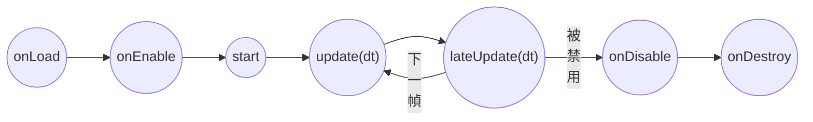

# Component 基本介紹

在 Cocos Creator 中，遊戲場景由無數個 `Node` 組合而成，若是要提供這些 `Node` 額外的功能，則需要在 `Node` 上掛上 Component，以達到額外的功能。Cocos 本身已提供常用的 Component，如圖片（Sprite）、文字（Label）、按鈕（Button）等，當有額外需求時，開發者也可以新增自定義的 Component 進行擴充。

!!! warning

    一個節點可以添加多個 Component，但只能有一個渲染的Component （如：Sprite、Label 等）

## 自定義元件

在資源管理器右鍵可以新增腳本，選擇 New Component 後編輯器會建立一個範本。


## Component 生命週期

Cocos 依據 Node 的 Active 狀態及 Component 本身的 enable 屬性對 Component 制定一系列的階段，被稱為生命周期（Life Cycle），包括以下幾個階段：

- `onLoad`
  　初始化階段，Component 被建立出來後，會在第一次 Node Active 時觸發。
  　早於下面所有的生命階段，通常被用於初始化與監聽事件。

- `onEnable`
  　當 Component 的 enable 變更為`true`時觸發。
  　若 Node 為首次 Active 時，將會在`onLoad`後、`start`前被調用

- `start`
  　首次執行 `update` 前觸發
  　通常會在這邊設定 Component 的初始狀態。

- `update`
  　**每一幀渲染前觸發**
  　參數 deltaTime 為這一幀的時間變化量 (單位:秒)

- `lateUpdate`
  　於`update`後被調用
  　參數 deltaTime 為這一幀的時間變化量 (單位:秒)

- `onDisable`
  　與 `onEnable` 相反，當 Component 的 enable 變更為`false`時觸發。
- `onDestroy`
  　當所在節點或組件本身調用了`destroy()`時觸發
  　在觸發的這一幀結束時會回收組件



<center>▲ 生命週期執行順序</center>

## Component 裝飾器

Cocos 使用裝飾器的方式讓編輯器能夠識別特定的對象，如 Component 或是其屬性等。因此可以發現，所有的 Component Class 上一行都會有 `@ccclass` 之類的語法，即為讓編輯器能夠辨識出該 Component 的方式。`@ccclass` 提供一個可選參數，可以指定 Component 的名稱，若無指定時預設會依 Component 的 Class Name 作為 Component Name。

!!! warning

    Component 名稱必須為唯一的，否則 Cocos 會無法正確辨識 Component。

### 屬性裝飾器 `@property`

透過`@property`，可以將一般的 Class 屬性標記為 Cocos(cc)屬性，使得該屬性可以顯示在編輯器上。
下面是一個簡單的使用範例：

```ts
const { ccclass, property } = _decorator;

@ccclass
export class TestProperty extends Component {
  @property
  private readonly message: string = "網路遊戲引擎原理與實作"; // 預設值，會反映在編輯器上

  protected onLoad(): void {
    console.log(`Message = ${this.message}`);
  }
}
```


@property 有相當多的可選參數，可以用來指定屬性的資料型別或是提供給編輯器使用限制

- type : 屬性的數據類型
  　需特別注意，如果屬性是 number，應填入 `CCInteger` 或 `CCFloat`
  　如果屬性是 boolean，應填入 `CCBoolean`
  　如果屬性是 string，應填入 `CCString`
  　一般的 ccclass (如: 一般 Class 或 Component) 直接填入 Class 即可，如 `@property({type: Node})`
  　
  　若是指定一個陣列，則屬性外需要包中括號，如 `@property({type: [Node]})`
  　
  　

!!! Note

    若是屬性有設定

除了 `type` 以外，主要還有以下幾種：

| 參數         | 類型    | 描述                                                                                                                                  |
| ------------ | ------- | ------------------------------------------------------------------------------------------------------------------------------------- |
| displayName  | string  | 於編輯器上顯示的名稱，未指定時是以屬性命名作為預設。                                                                                  |
| visible      | boolean | 是否會顯示於編輯器上，可以是一個回傳 boolean 的函式，詳見下方範例。                                                                   |
| tooltip      | string  | 在編輯器上顯示一些敘述，Hover 於名稱時顯示。                                                                                          |
| min          | number  | 限定數值在編輯器上輸入的最小值。                                                                                                      |
| max          | number  | 限定數值在編輯器上輸入的最大值。                                                                                                      |
| displayOrder | number  | Property 顯示的排序方式，此數值越小的 Property 會顯示在越上層，預設是 `Infinity`，修改後原有的 `Component` 不會立即生效，需要 Reset。 |
| override     | boolean | 若 `Child Class` 要 Override `Parent Class` 的 Property 設定，需要設置此項為 `true`，否則會出現警告                                   |

- 更多詳細的參數可以參考 [Cocos 官方文件](https://docs.cocos.com/creator/3.6/manual/zh/scripting/reference/attributes.html)

#### `visible` 參數補充

若將 `visible` 指定為一個 Function，可以達到將其他 Property 作為開關判斷是否顯示該 Property。

```ts
@property
private readonly showMessage: boolean = false;
@property({
    visible() {
        return this.showMessage;
    },
})
private readonly message: string = '網路遊戲引擎原理與實作';
```


#### Property Class

當有一組多個 Property 常被使用到時，我們通常會將它作為一個 Class，在將它作為 Property `type` 設定上去，如此一來不需要重複宣告相同的 `attribute`，也可以將其設定為 Property Array。

下面的範例即是將 `a`、`b`、`c` 作為一組 Property Class 用於 `ComponentA` 上的 ABCArray。

```ts
// 就算不是 Component 也必須使用 ccclass，否則 Cocos 編輯器無法正確判讀
@ccclass("ABC")
class ABC {
  @property()
  public readonly a: number = 112;
  @property()
  public readonly b: string = "網路遊戲引擎原理與實作";
  @property()
  public readonly c: string = "Cocos Creator";
}

@ccclass
export class ComponentA extends Component {
  // type: [ABC] 代表此 property 是 class ABC 的陣列
  @property({ type: [ABC] })
  private readonly ABCArray: ABC[] = [];
}
```


### 其他常見的裝飾器

#### @requireComponent

可以使用此裝飾器限制 Component 必須要先有哪個組件才能附加到 Node 上。


#### @disallowMultiple

避免在同一個 Node 上附加相同的 Component。


## Component 常用方法

### 查找 Node 上的 Component

```ts
  protected onLoad(): void {
    const label1: Label = this.node.getComponent(Label); // 取得 Node 上指定的 Component
    const label2: Label = this.getComponent(Label); // 與上一行功能相同，單純不依靠node
    const label3: Label = this.getComponent('Label'); // 不import class的方式查找，不利於 Debug也無法提供語法提示 因此不建議使用
    const labels: Label[] = this.getComponents(Label); // 取得Node所有 Label Component

    const label4 = this.node.getComponentInChildren(Label); // 取得子點節上指定的 Component
    const labels2 = this.node.getComponentsInChildren(Label); // 取得子點節上所有指定的 Component
  }
```

## 範例：顯示目前時間

```ts
import { _decorator, Component, Label, Color } from "cc";

const { ccclass, property } = _decorator;

@ccclass("CurrentTime")
export class CurrentTime extends Component {
  @property({ type: Label, tooltip: "顯示時間用的Label" })
  private readonly timeLabel: Label = null;

  protected onLoad(): void {
    this.timeLabel.color = Color.GREEN; // 將文字設為綠色
  }

  protected update(deltaTime: number): void {
    // 每一幀更新顯示的時間
    this.timeLabel.string = `現在時間: ${new Date().toLocaleString()}`;
  }
}
```
