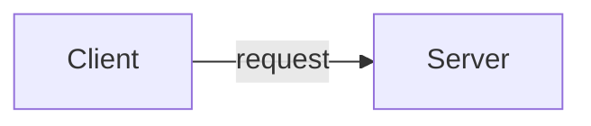
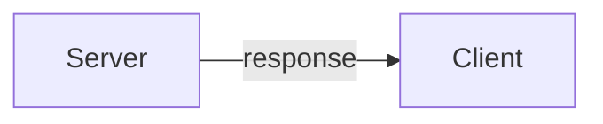

# HTTP request


## 流程

* Client向Server請求



* Server向Client回應


## 使用 Fetch 發送請求 ( request )
```js
fetch("http://example.com/movies.json")
  .then(function (response) {
    return response.json();
  })
  .then(function (myJson) {
    console.log(myJson);
  });
```

## 發 POST Request
```js

const url = 'https://api.example.com/endpoint';
const data = {
  name: 'John',
  age: 30
};
const options = {
  method: 'POST',
  headers: {
    'Content-Type': 'application/json'
  },
  body: JSON.stringify(data)
};

fetch(url, options)
  .then(response => response.json())
  .then(data => {
    console.log(data);
  })
  .catch(error => {
    console.log(error);
  });

```


## RESTful API
Restful API（Representational State Transfer）是一種基於 HTTP 協議的**設計風格**。

使用標準的 HTTP 動詞（GET、POST、PUT、DELETE 等）來操作。
例如，使用 GET 來獲取資料，使用 POST 來新增，使用 PUT 來更新，使用 DELETE 來刪除。

* GET (取得)
* POST (新增)
* PUT (修改)
* DELETE (刪除)
* PATCH (修改部分資料)

## 與一般的API的差異

|     | 一般的API  | RESTful API |
|  :----:  | :----:  | :----: |
| 創建使用者  | `POST` `/createUser` | `POST` `/user` |
| 更新使用者  | `POST` `/updateUser` | `PUT` `/user` |
| 取得使用者  | `POST` `/getUser` | `GET` `/user` |
| 刪除使用者  | `POST` `/deleteUser` | `DELETE` `/user` |

## RESTful API 有哪些優勢？

* 可擴展性

伺服器不必保留過去的用戶端請求資訊，透過無狀態和有效的快取機制來減少伺服器負擔，提升系統的擴展能力且減少效能瓶頸。

* 靈活性

RESTful Web 服務允許用戶端和伺服器分離，各部件可以獨立演進，使得平台或技術變更不會影響到對方，並使應用程式功能更加分層和靈活。
例如，開發人員可以在不重寫應用程式邏輯的情況下，對資料庫層進行變更。

* 獨立性

您可以使用各種程式設計語言來編寫用戶端和伺服器應用程式，而不會影響 API 設計。

## Http Code 狀態碼

* HTTP Status Code 1xx 訊息

這一類型的狀態碼，代表請求已被接受，需要繼續處理。這類回應是臨時回應，只包含狀態行和某些可選的回應頭資訊，並以空行結束。

* HTTP Status Code 2xx 成功

請求已成功被伺服器接收、理解、並接受。

`200 OK`：成功

`204 No Content`：成功，但沒有回傳的內容

* HTTP Status Code 3xx 重新導向

通常這些狀態碼用來重新導向。

`301 Moved Permanently`：資源**永久**移到其他位置

`302 Found (Moved Temporarily)`：資源**暫時**移到其他位置

`304 Not Modified`：從快取拿東西

* HTTP Status Code 4xx 客戶端錯誤

`400 Bad Request`：請求語法錯誤…等等

`401 Unauthorized`：未認證

`403 Forbidden`：禁止存取，可能是沒有權限

`404 Not Found`：找不到資源

* HTTP Status Code 5xx 伺服器錯誤

`500 Internal Server Error`：伺服器出錯

`502 Bad Gateway`：服務沒有正確執行

## reference
1. [https://developer.mozilla.org/zh-TW/docs/Web/API/Fetch_API/Using_Fetch](https://developer.mozilla.org/zh-TW/docs/Web/API/Fetch_API/Using_Fetch)

1. [https://aws.amazon.com/tw/what-is/restful-api/](https://aws.amazon.com/tw/what-is/restful-api/)