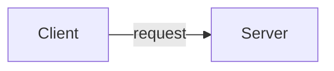
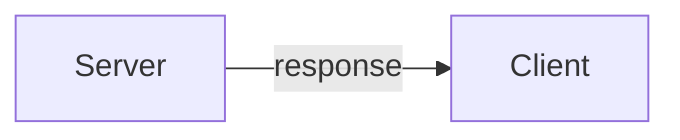

# HTTP request


## 流程

* Client向Server請求



* Server向Client回應


## 使用 Fetch 發送請求 ( request )
```js
fetch("http://example.com/movies.json")
  .then(function (response) {
    return response.json();
  })
  .then(function (myJson) {
    console.log(myJson);
  });
```

## 發 POST Request
```js

const url = 'https://api.example.com/endpoint';
const data = {
  name: 'John',
  age: 30
};
const options = {
  method: 'POST',
  headers: {
    'Content-Type': 'application/json'
  },
  body: JSON.stringify(data)
};

fetch(url, options)
  .then(response => response.json())
  .then(data => {
    console.log(data);
  })
  .catch(error => {
    console.log(error);
  });

```


## RESTful API
Restful API（Representational State Transfer）是一種基於 HTTP 協議的設計風格。

使用標準的 HTTP 動詞（GET、POST、PUT、DELETE 等）來操作。
例如，使用 GET 來獲取資料，使用 POST 來新增，使用 PUT 來更新，使用 DELETE 來刪除。

* GET (取得)
* POST (新增)
* PUT (修改)
* DELETE (刪除)
* PATCH (修改部分資料)

## 與一般的API的差異

|     | 一般的API  | RESTful API |
|  :----:  | :----:  | :----: |
| 創建使用者  | `POST` `/createUser` | `POST` `/user` |
| 更新使用者  | `POST` `/updateUser` | `PUT` `/user` |
| 取得使用者  | `POST` `/getUser` | `GET` `/user` |
| 刪除使用者  | `POST` `/deleteUser` | `DELETE` `/user` |


## reference
1. https://developer.mozilla.org/zh-TW/docs/Web/API/Fetch_API/Using_Fetch