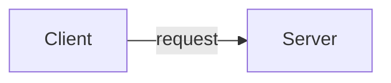
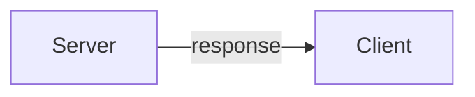

# HTTP request

## 介紹

HTTP 全名為 Hyper Text Transfer Protocol 超文字傳輸協定，
是網際網路上應用最廣泛的協定之一，
在 OSI 網路模型裡，它屬於應用層的協定。

## HTTPS
HTTPS（HTTP Secure）是HTTP的安全版本，在HTTP下加入了SSL/TLS協定，為數據傳輸提供了加密和身份驗證的保障。


## 流程

- Client 向 Server 請求



- 請求格式
  [^1]: https://developer.mozilla.org/en-US/docs/Web/HTTP/Overview


- Server 向 Client 回應



- 回應格式[^1]


## URL 格式


在該例子中：

- abc 是協定名稱
- username 是用戶
- password 是密碼
- example.com 是網域
- 123 是連線的 port
- /path/data 是路徑
- ?key=value&key2=vale2 是查詢字串
- fragid1 是 fragment

## HTTP Code 狀態碼

- HTTP Status Code 1xx 訊息

這一類型的狀態碼，代表請求已被接受，需要繼續處理。這類回應是臨時回應，只包含狀態行和某些可選的回應頭資訊，並以空行結束。

- HTTP Status Code 2xx 成功

請求已成功被伺服器接收、理解、並接受。

`200 OK`：成功

`204 No Content`：成功，但沒有回傳的內容

- HTTP Status Code 3xx 重新導向

通常這些狀態碼用來重新導向。

`301 Moved Permanently`：資源**永久**移到其他位置

`302 Found (Moved Temporarily)`：資源**暫時**移到其他位置

`304 Not Modified`：從快取拿東西

- HTTP Status Code 4xx 客戶端錯誤

`400 Bad Request`：請求語法錯誤…等等

`401 Unauthorized`：未認證

`403 Forbidden`：禁止存取，可能是沒有權限

`404 Not Found`：找不到資源

- HTTP Status Code 5xx 伺服器錯誤

`500 Internal Server Error`：伺服器出錯

`502 Bad Gateway`：服務沒有正確執行

## HTTP 動詞
* GET (取得)
* POST (新增)
* PUT (修改)
* DELETE (刪除)

[其他HTTP動詞](https://developer.mozilla.org/zh-TW/docs/Web/HTTP/Methods)

### HTTP GET
* HTTP GET 方法沒有請求體（ request body ）。

!!! note
    不建議在 GET 中使用登入帳號密碼，
    URL 參數是以明文形式傳輸的，在未加密的情況下帳號密碼可以在 URL 被看見。
    
    例如: `/login?account=admin&password=123`

## RESTful API

RESTful API 是一種基於 HTTP 協議的設計風格，
REST 代表 Representational State Transfer（表述性狀態轉移），
使用標準的 HTTP 動詞（GET、POST、PUT、DELETE 等）來操作。

例如，使用 GET 來獲取資料，使用 POST 來新增，使用 PUT 來更新，使用 DELETE 來刪除，這些對應於 CRUD 操作。


### 主從式架構 (Client-Server)
將客戶端與服務端分離，
任何一個客戶端實例都可以向同一服務器發出請求，
這種架構提高了可擴展性、可移植性。

### 無狀態
單純從request決定response。

意思是每一個請求都包含了該服務邏輯所需的完整訊息，
服務端不負責記錄請求方的用戶狀態。

### 分層
1. `GET /user/{uid}/post/{postid}`

2. `GET /user/{uid}/profile`

3. `GET /user/{uid}/friend`

4. `GET /user/{uid}/groups`

這個系列 `GET /user/{uid}`

可以將一些共用的邏輯抽離到中介層(middleware)來處理

依`GET /user/{uid}/post/{postid}`為例

驗證 uid 是否存在，如果不存在，回傳 404 Not Found。

### 統一操作介面
統一操作介面(Uniform Interface)原則是REST架構的核心，
規定資源對應唯一URL。


    
## 與一般的 API 的差異

|            |      一般的 API      |   RESTful API    |
| :--------: | :------------------: | :--------------: |
| 創建使用者 | `POST` `/createUser` |  `POST` `/user`  |
| 更新使用者 | `POST` `/updateUser` |  `PUT` `/user/{uid}`   |
| 取得使用者 |  `POST` `/getUser`   |  `GET` `/user/{uid}`   |
| 刪除使用者 | `POST` `/deleteUser` | `DELETE` `/user/{uid}` |

## RESTful API 有哪些優勢？

[^3]: https://aws.amazon.com/tw/what-is/restful-api/

- 可擴展性[^3]

伺服器不必保留過去的用戶端請求資訊，透過無狀態和有效的快取機制來減少伺服器負擔，提升系統的擴展能力且減少效能瓶頸。

- 靈活性

RESTful Web 服務允許用戶端和伺服器分離，各部件可以獨立演進，使得平台或技術變更不會影響到對方，並使應用程式功能更加分層和靈活。
例如，開發人員可以在不重寫應用程式邏輯的情況下，對資料庫層進行變更。

- 獨立性

可以使用各種程式設計語言來編寫用戶端和伺服器應用程式，而不會影響 API 設計。

[^2]: https://developer.mozilla.org/zh-TW/docs/Web/API/Fetch_API/Using_Fetch

## POST Request

```js
postData('http://example.com/answer', { answer: 42 })
  .then((data) => console.log(data))
  .catch((error) => console.error(error));

function postData(url, data) {
  return fetch(url, {
    body: JSON.stringify(data),
    headers: {
      'user-agent': 'Mozilla/4.0 MDN Example',
      'content-type': 'application/json',
    },
    method: 'POST', // HTTP動詞，預設為GET
  }).then((response) => response.json());
}
```

範例程式碼[^2]中有幾個比較重要的參數

1. **`url`** 是 API 的網址
2. **`body`** 提供給伺服器的資訊，上面的範例為將 `data` 物件轉為JSON字串作為 body 提供給 Server
3. **`headers`** 可以放入 Http 的 Header資訊，一般常見的屬性包含 User-Agent、Content-Type 等...，較詳細的可以參考 [MDN](https://developer.mozilla.org/en-US/docs/Web/HTTP/Headers)
4. **`method`** 放入 HTTP動詞，如 `GET`、`POST` 等

## 氣象資料開放平台 API 實作
1. 到[氣象資料開放平台](https://opendata.cwa.gov.tw/index)註冊帳號


2. 註冊一個帳號 [https://pweb.cwa.gov.tw/emember/register](https://pweb.cwa.gov.tw/emember/register)


3. 到電子信箱啟用會員後再次[登入](https://opendata.cwa.gov.tw/userLogin)


4. 登入後取得授權碼並將授權碼複製下來


5. 前往開發指南查看[api文件](https://opendata.cwa.gov.tw/dist/opendata-swagger.html)


6. 可以在swagger文檔中使用API request


7. 填入需要的參數後點擊Execute執行


8. 執行後的回傳結果


## 執行程式碼

* Url 格式


* BaseUrl


* API Path


```js
const baseUrl = "https://opendata.cwa.gov.tw/api/v1/"
const path = "rest/datastore/F-D0047-063"
const authorization = "yourAuthorization"
fetch(`${baseUrl}${path}?Authorization=${authorization}`)
  .then((response) => {
    return response.json();
  })
  .then((myJson) => {
    console.log(myJson); // 輸出json資料
  });
```

* 結果輸出


## 混合內容（mixed content）
一個含有 HTTP 明文內容的 HTTPS 頁面稱為混合內容[^5]（mixed content），
這種頁面只有部份加密，沒有加密的內容，易於遭到竊聽和中間人攻擊。這會令網頁不安全。

為了確保整個網站的安全性，瀏覽器禁止在使用HTTPS的網站中請求HTTP。

混合內容分為2種

1. 被動/顯示型混合內容
2. 主動型混合內容

瀏覽器允許部分被動/顯示型混合內容存取。

* 圖片資源 ( img )
* 音訊資源 ( audio )
* 影片資源 ( video )

主動型混合內容，可以改變 HTTPS 頁面行為、並暗自竊取用戶的敏感資訊。

* JavaScript資源
* CSS資源

[^5]:https://developer.mozilla.org/zh-TW/docs/Web/Security/Mixed_content


## CORS (Cross-Origin Resource Sharing)

CORS是一種瀏覽器**安全機制**，當在網頁中使用 JavaScript 發起跨域請求時，瀏覽器會執行同源策略，阻止該請求，以保護使用者的安全。

### 同源策略 (Same-Origin Policy)
同源是指**相同域名(domain)、協議(protocol)跟端口(port)**，
在同源策略下，僅允許網頁從與它自己相同的原始來源來載入資源。
在某些情況下，網頁需要與其他來源的資源，例如使用不同網域的 API。

在伺服器端可以設定 CORS 的限制，確保僅允許來自特定網域的請求或限制允許的 HTTP 方法和標頭。
這有助於防止跨站腳本攻擊(XSS)和跨站點請求偽造(CSRF)等安全風險。

* 出現CORS的錯誤可能類似下圖情境[^4]
[^4]:https://miro.medium.com/v2/resize:fit:1400/format:webp/0*bI2yxKryqJzyUkud


