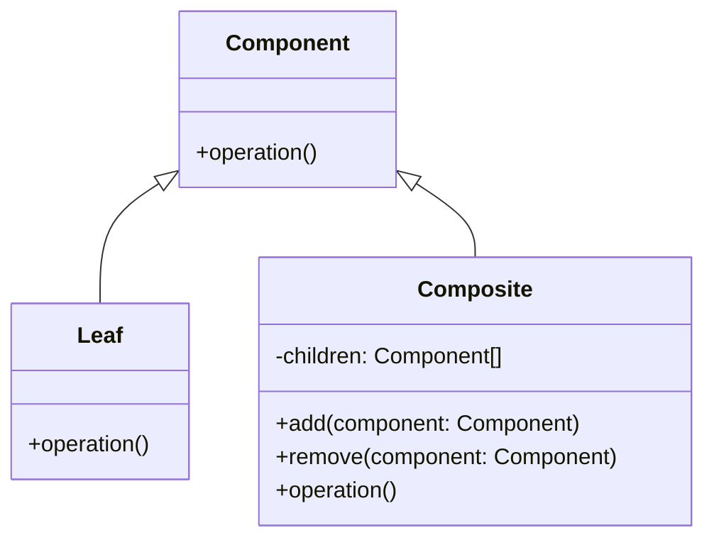

# 組合模式

### 組合模式核心概念

- 將多個小物件組成大物件
- 每個小物件具有相同的介面
- 以樹狀的方式進行組合

它的結構圖會類似於



組合模式特別適用於需要樹狀結構的需求，它可以透過統一的介面處理個別元素，從而簡化程式碼，也使開發者更易於理解、維護，甚至是擴充系統，這種設計方法也符合物件導向中的開閉原則(Open/Closed Principle)。以下是一些使用到組合模式觀念的案例：

#### HTML

在 HTML 中，DOM（Document Object Model）就是一個典型的組合模式的應用。HTML 文件可以被看作是一個樹狀結構，由各種元素（如 <div\>、<p\>、<span\> 等）組成，而每個元素都可以包含子元素或文本節點。這樣的樹狀結構可以被輕鬆地表示為一個組合模式。我們舉一個範例：

```html
<html>
  <head>
    <title>組合模式示例 - HTML</title>
  </head>
  <body>
    <div>
      <p>段落1</p>
      <p>段落2</p>
      <div>
        <span>SPAN</span>
      </div>
    </div>
  </body>
</html>
```

在這個例子中，`<html>` 元素包含 `<head>` 和 `<body>` 子元素，而 `<body>` 元素包含了多個 `<div>`、`<p>`、和 `<span>` 子元素，形成了一個樹狀結構。這樣的結構使得我們可以以統一的方式處理 HTML 文件，並且可以輕鬆地新增、修改或移除元素，符合組合模式的特點。

#### Cocos 場景

在 Cocos Creator 中的場景亦是一種組合模式的應用，場景本身是由多個 Node 組成，每個 Node 可以包含其他 Node，形成了一個樹狀結構。這個組合結構使得開發者能夠以統一的方式管理場景中的各個元件，並在需要時輕鬆擴充或修改場景的功能。

關於 Node 實際的用法，請參考 [Node & 坐標系統](../cocos/node-and-coord.md)
