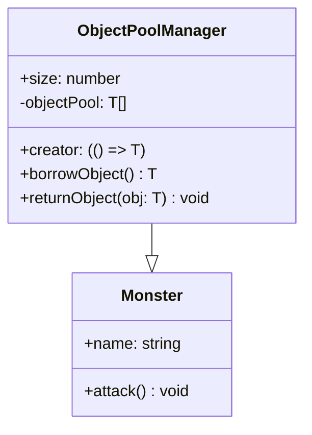

# 物件池模式

在遊戲中時常會有重複的元件頻繁的被使用（Ex: 怪物, 道具, 特效等），當這些元件初始化時由較高的效能損耗，或是元件本身經常需要被創建與銷毀，我們通常就會使用物件池的方式改善系統效能。

物件池模式的核心思想是將那些需要被重複使用的元件事先創建好，存放在一個池(Pool)中。當需要使用時，不再重新創建新的元件，而是直接從池中借用，使用完畢後歸還到池中。這樣可以減少頻繁創建和銷毀元件的開銷，提高效能。

### 主要角色

- **物件池（Object Pool）**：存放需要被重複使用的元件的容器。通常實現為一個集合，如陣列或鏈表。
- **物件（Object）**：需要被重複使用的實際元件，例如怪物、道具、特效等。

### 使用範例

### Cocos 中的使用

**NodePool** - 詳細使用方法可以參考 [Prefab & NodePool](../cocos/resource/prefab.md)
