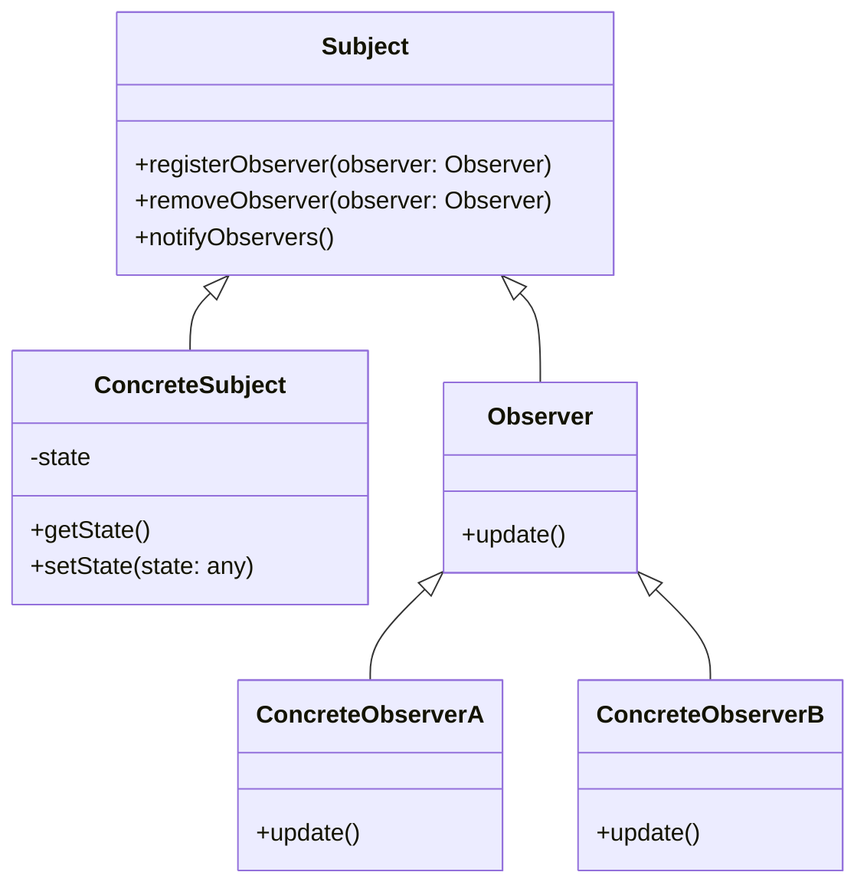

# 觀察者模式

觀察者模式（Observer Pattern）是一種行為型設計模式，它定義了一種一對多的依賴關係，使一個物件的狀態改變時，所有依賴於它的物件都能收到通知並進行更新。在觀察者模式中，主要有兩種不同身分的類別，並各自實現對應的 Methods：

- **主題 (Subject)**

  - registerObserver：用於註冊新的觀察者，以追蹤主題的變化。
  - removeObserver： 移除已註冊的觀察者。
  - notifyObservers：當發生變化時，通知所有已註冊的觀察者。

- **觀察者 (Observer)**
  - update：當主題的狀態發生變化時，主題應調用此方法讓觀察者進行更新。

## Diagrams

## 使用情境

### 事件系統

遊戲中有許多事件，如角色移動、碰撞、技能使用等。這些事件可能需要通知其他遊戲元件（Ex: UI 元件、敵人、道具等）。觀察者模式可用於實現一個事件系統，使得遊戲元件可以註冊為事件的觀察者，當事件發生時得到通知。

### 狀態管理

當遊戲狀態改變時（Ex: 遊戲開始, 遊戲暫停, 進入下一局），透過`notifyObservers`通知所有相關的 UI 進行更新，這些 UI 元件就可以僅依賴觀察者模式達到更新，從而降低對具體服務的直接相依性。

## Cocos 中的使用

### 事件系統 EventTarget

- **event.emit** : 對應 `Subject.notifyObservers`
- **event.on** : 對應 `Subject.registerObserver`, params 的 callback 對應 `Observer.update`

詳細使用方法可以參考 [事件系統](../cocos/events.md)
